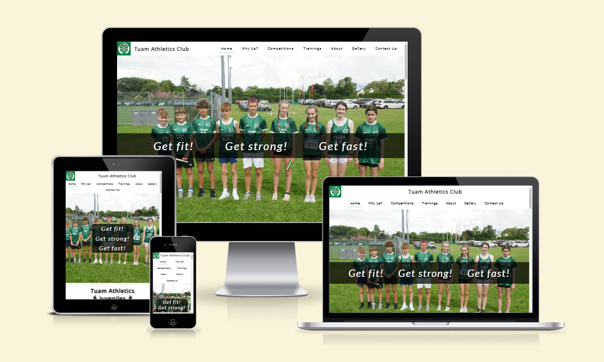
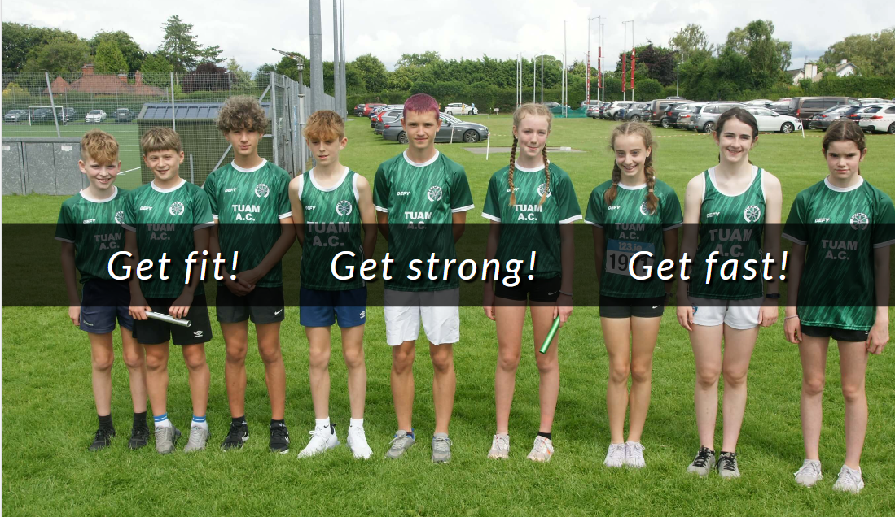
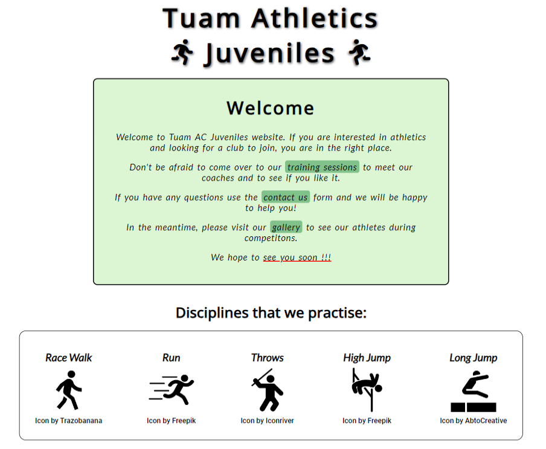

# Tuam AC Juvenile Section

Tuam AC is a website that introduces the club to the local community as well as the rest of the Irish resident. ?

The Tuam AC Juveniles website is about the youth section of the Tuam Athletics Club. Its main purpose is to inform people about the club in the Tuam area, County Galway, Ireland. As well as about the disciplines that young people are practiced in the club.

The link to the website can be found here - [Tuam AC Juveniles]()

## Site owner goals

- Provide the user with information about the sports that are practiced in the club.
- Provide the user with the necessary information about trainings - day, time and place, that can be easily found on google map.
- Present a brief history of the club - when Tuam AC was founded and when the youth section was established.
- Give the user the opportunity to contact the club about joining the club, trainings, competitions or any other matter.

## User view

User should be able to find information about the disciplines

## Features

Tuam AC Juveniles includes welcome message from the club committe and disciplines the club is participating.
There is also a Why us section, which tell the users why they should join this club as well as competition type the club is taking part and basic information about trainings - days, times and places - which could be find on the google mini maps.
It also contains an About page with minimal information about the club but with information about the beginning of the youth section, and this is the main theme of the page.
The gallery page shows pictures from the last competitions which club athletes took part.
There is also Contact Us website with form for users if they need to contact the club.

### Existing Features

- ### Navigation Bar
  - The fully responsive navigation bar includes club logo, club name and navigation links to Club Logo, Home, Why Us?, Competitions, Trainings, About, Gallery and Contact Us.

- ### The landing page image
  - The landig image includes athletes of Tuam AC with a text that include the club spirit.

- ### Welcome
  - The welcome section introduce a friendly welcome message for user. It's also given user a direction to different parts of the website (trainings) or to another websites (contact us and gallery).
  - It also contains information about the disciplines that can be practiced in the club.

- ### Why Us? Section

  - This section shows five reasons why the new user should join the club.
  - For each reason there is an image to better understanding the reason and give users a feeling that they should join the club.
  - Each reason has different background and frame color taken from the Olympic flag to give the user a sense that this club is something special.
  - There is also a link to Contact Us website to help the user contact the club.

- ### Competitions Section

  - Introduce the user the three main competitions in which Tuam AC athletes take part during the season year (Indoor, Outdoor, Cross Contry).
  - Each event is divided by three competition types - Indoor, Outdoor and All-Ireland.

- ### Trainings Section

  - This section is to inform the user on what days and at what time there is training for children.
  - It also lists the location where the training will take place with an attached map for easier finding.

- ### Footer

  - The footer includes links to the relevant social media platforms such as Facebook, Instagram, Twitter and YouTube.
  - The links are open in new tabs to provide easy navigation for the user.

  - It also provodes likns to club Code of Conduct and Polices which should open i pop up window.
  - There is also club logo link in the middle of the footer which allow user to back on the main page.
  - It also inludes a copyright and designer information as well as allow user to contact the owner of the page.

- ### About Website
  - The About section will give user a short brief of the beggining of Tuam AC. It also provides information about start of juveniles section under the Tuam AC.

<!--
- ### Gallery Website
    - The gallery will provide the user with images of Tuam AC athletes in the competitions they have participated in.
 -->

- ### Contact Website

  - This page allow user to contact with the club.
  - It also specify that the user should fill the form in given way and mandatory fields should be fill in exact way for the form could be submitted.
  - It also provides user with an option about the reason of contact like joining the club, trainings, competitions or general querie.

- ### Thank You Website
  - This wesite provide a short notice to the user that the form was submitted

### Features Left to Implement

- #### Header

  - Add the Hamburger Menu icon for small screen resolution when the header content takes to much space.

- #### Footer
  - The Code of Conduct and Polices links should open in pop up windows

## Design

### Images

All athletes images are from my private collection and they were took over the different competitions during the 2023.
The rest pictures/images are taken from [!Unsplash](https://unsplash.com/) website.

### Colors

The main colors of the website are white and green. Both where took from the club logo. Only for the Why Us? section I used olimpic rings colors for the reasons.

### Fonts

The main fonts which I used for the website are Lato, Open Sans and Roboto. All were imported via [Google Fonts](https://fonts.google.com/). Also I'm using sans-serif font as a backup in case if the main fonts won't be imported into the website correctly.

## Testing

### Validation Testing

- #### HTML

  - No errors where found when go threw the W3C Markup Validator
    - [W3C Validator Result] ( tutaj adres strony z wynikiem)

- #### CSS

  - No errors were found when passing through the official W3C CSS Validator
    - [W3C CSS Validator Results] (tutaj adres strony W3C z wynikiem)

- #### Accessibility
  - The site achieved a Lighthouse accessibility score of 100% which confirms that the colours and fonts chosen are easy to read and accessible

![Lighthouse score] (zdjecie z wynikiem z testu lighthouse z folderu docs na githubie np. dosc/readme_images/lighthouse_testing.png)

## Bugs

- ### Thank you site
  - In footer the social media section is not visible. Don't know how to fix this. Will look for solution.

## Deployment

The project was deployed using GitHub pages. The steps to deploy using GitHub pages are:

1. Go to the repository on GitHub.com
2. Select 'Settings' near the top of the page.
3. Select 'Pages' from the menu bar on the left of the page.
4. Under 'Source' select the 'Branch' dropdown menu and select the main branch.
5. Once selected, click the 'Save'.
6. Deployment should be confirmed by a message on a green background saying "Your site is published at" followed by the web address.

The live link can be found here - [Tuam Athletics Club Juveniles] (https://lukas2020-code.github.io/TuamAC_Project/)
