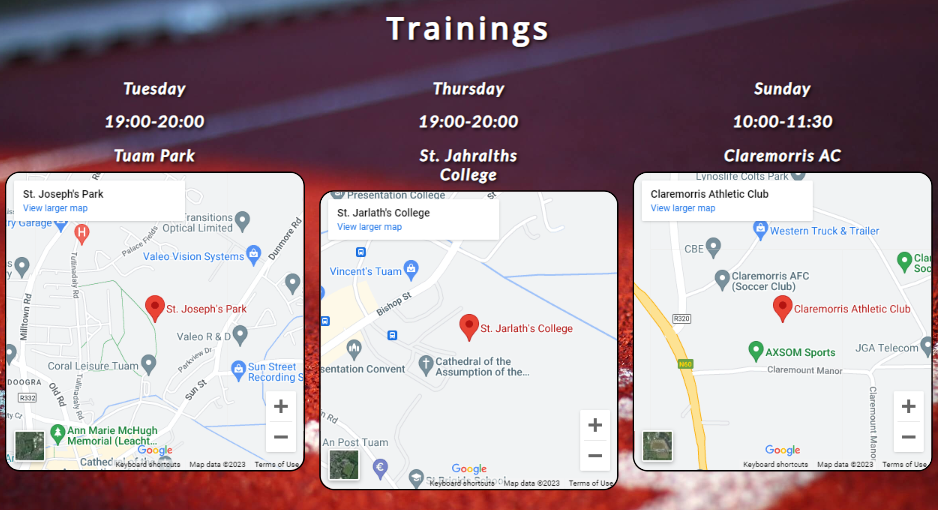

# Tuam AC Juvenile Section

Tuam AC is a website that introduces the club to the local community as well as the rest of the Irish residents.

The Tuam AC Juveniles website is about the youth section of the Tuam Athletics Club. Its main purpose is to inform people about the club in the Tuam area, County Galway, Ireland. As well as about the disciplines that young people are practiced in the club.

The link to the website can be found here - [Tuam AC Juveniles](https://lukas2020-code.github.io/TuamAC_Project/)

## Site owner goals

- Provide the user with information about the sports that are practiced in the club.
- Provide the user with the necessary information about trainings - day, time and place, that can be easily found on google map.
- Present a brief history of the club - when Tuam AC was founded and when the youth section was established.
- Give the user the opportunity to contact the club about joining the club, trainings, competitions or any other matter.

## User view

User should be able to find information about the disciplines which are training within the club. It should also find the information about trainings, competitions and be able to contact the club if have any questions.

## Features

Tuam AC Juveniles includes welcome message from the club committe and disciplines the club is participating.
There is also a Why us section, which tell the users why they should join this club as well as competition type the club is taking part and basic information about trainings - days, times and places - which could be find on the google mini maps.
It also contains an About page with minimal information about the club but with information about the beginning of the youth section, and this is the main theme of the page.
The gallery page shows pictures from the last competitions which club athletes were participated.
There is also Contact Us website with form for users if they need to contact the club.

### Existing Features

- ### Navigation Bar

  - The fully responsive navigation bar includes club logo, club name and navigation links to Home, About, Gallery and Contact Us pages as well as Why Us?, Competitions and Trainings sections.

- ### The landing page image

  - The landig image includes athletes of Tuam AC with a text that include the club spirit.

- ### Welcome

  - The welcome section introduce a friendly welcome message for user. It's also given user a direction to different parts of the website (trainings) or to another websites (contact us and gallery).
  - It also contains information about the disciplines that can be practiced in the club.

- ### Why Us? Section

  - This section shows five reasons why the new user should join the club.
  - For each reason there is an image to better understanding the reason and give users a feeling why they should join the club.
  - Each reason has different background and frame color taken from the Olympic flag to give the user a sense that this club is something special.
  - There is also a link to Contact Us website to help the user contact the club.

- ### Competitions Section

  - Introduce the user the three main competitions in which Tuam AC athletes take part during the season year (Indoor, Outdoor, Cross Contry).
  - Each event is divided by three competition types - Indoor, Outdoor and All-Ireland.

- ### Trainings Section

  - This section is to inform the user on what days and what time there is training for children.
  - It also lists the location where the training will take place with an attached map for easier finding.

- ### Footer

  - The footer includes links to the relevant social media platforms such as Facebook, Instagram, Twitter and YouTube.
  - The links are open in new tabs to provide easy navigation for the user.

  - It also provodes likns to club Code of Conduct and Polices which should open in a pop up window.
  - There is also club logo link in the middle of the footer which allow user to go back on the main page.
  - It's also includes a copyright and designer information as well as allow user to contact the owner of the page throught the email.

- ### About Website

  - The About website will give user a short brief of the beggining of Tuam AC. It also provides information about start of juveniles section under the Tuam AC.

- ### Gallery Website

  - The gallery will provide the user with images of Tuam AC athletes in the competitions they have participated in.

- ### Contact Website

  - This website allow user to contact with the club.
  - It also specify that the user should fill the form in given way and mandatory fields should be fill in exact way for the form could be submitted.
  - It also provides user with an option about the reason of contact like joining the club, trainings, competitions or general querie.

- ### Thank You Website

  - This wesite provide a information to the user that the form was succecfully submitted.
  - There is also a link link in that message that will take user back to home website.

### Features Left to Implement

- #### Header

  - Add the Hamburger Menu icon for small screen resolution when the header content takes to much space.

- #### Footer

  - The Code of Conduct and Polices links should open in pop up windows

## Design

### Images

All athletes images are from my private collection and they were took over the different competitions during the 2023.
The rest pictures/images are taken from [!Unsplash](https://unsplash.com/), and [FreeImages](https://www.freeimages.com/) and [Freepik](https://www.freepik.com/).

### Icons

Icons were taken from [FontAwesome](https://fontawesome.com/) - index.html heading and [Freepik](https://www.freepik.com/) - disciplines.

### Colors

The main colors of the website are white and green. Both where took from the club logo. Only for the Why Us? section I used olimpic rings colors for the five reasons why to join the club.

### Fonts

The main fonts which I used for the website are Lato, Open Sans and Roboto. All were imported via [Google Fonts](https://fonts.google.com/). Also I'm using sans-serif font as a backup just in case if one the main fonts won't be imported into the website correctly.

## Testing

### Validation Testing

- #### HTML

  - No errors where found when go threw the W3C Markup Validator
    - [W3C Validator Result](https://validator.w3.org/nu/?doc=https%3A%2F%2Flukas2020-code.github.io%2FTuamAC_Project%2F)

- #### CSS

  - No errors were found when passing through the official W3C CSS Validator
    - [W3C CSS Validator Results](https://jigsaw.w3.org/css-validator/validator?uri=https%3A%2F%2F8000-lukas2020-code-tuamac-pr-o3pzfgis6j.us2.codeanyapp.com%2F)

- #### Performance and Accessibility

  - Pertformance achived by site is on a very good level. Site load fast and user can enjoy it right away.

  - The site achieved a Lighthouse accessibility score of 100% which confirms that the colours and fonts chosen are easy to read and accessible.

- #### Form Testing

  - The form has been tested to ensure that it won't be submitted without filling the mandatory fields (name, email, phone no., way of contact and reason of contact) so the club can contact back with user.

- #### Browser Testing

  - The websites were tested on Google Chrome, Microsoft Edge, Opera, Firefox, Brave and Safari with no issue found.

- #### Device Testing

  - The website was test on several different devices by familly members and friends to check the responsiveness. Devices includes: Desktop, Laptops (various creen sizes), Tablets (Samsung Tab6, Huawei Media Pad5) and Phones (Huawei P9, Nokia G20, IPhone 14).

## Bugs

- ### Conatct website

  - In phone number input, user can also write a letters if use a laptop or desktop keyboard. For tablet and phones it shows a numeric keypad to write the number. I found out that not all browsers support input type="tel" and they fall back to standard text input.

- ### Thank you site

  - In footer the social media section is not visible. Will look for solution to fix it.

## Fixed Bugs

- On wide but not height screens the form was outside the section and bacgroung image. Change the height of the form to fit-content and add more padding aroun the form.

## Technologies Used

- ### Languages
- HTML 5
- CSS

### Framework - Libraries - Programs Used

- [Am i Responsive](https://ui.dev/amiresponsive) - used to check responsivenes of the websites on different screen devices.
- [Chrome Dev Tools](https://developer.chrome.com/docs/devtools/) - Used for overall development including testing responsiveness and performance.
- [Font Awesome](https://fontawesome.com/) - Used for heading in welcome section and Social Media icons in footer.
- [Codeanywhere](https://codeanywhere.com/) - Use to wrtite and style the websites and deploy to git hub.
- [GitHub](https://github.com/) - Used for version control and hosting.
- [Google Fonts](https://fonts.google.com/) - Used to import and alter fonts on the page.
- [TinyPNG](https://tinypng.com/) - Used to compress images to reduce file size without a reduction in quality.
- [W3C](https://www.w3.org/) - Used for HTML & CSS Validation.

## Deployment

The project was deployed using GitHub pages. The steps to deploy using GitHub pages are:

1. Go to the repository on GitHub.com
2. Select 'Settings' near the top of the page.
3. Select 'Pages' from the menu bar on the left of the page.
4. In Build and deployment section, select "Source" dropdown menu and select Deploy from branch, then select the 'Branch' dropdown menu and select the main branch.
5. Once selected, click the 'Save' button.
6. Deployment should be confirmed by a message on a green background saying "Your site is published at" followed by the web address. Like this:

The website can be found here - [Tuam Athletics Club Juveniles](https://lukas2020-code.github.io/TuamAC_Project/)

## Credits

### Content

- All athletes images are from my private source. They were taken by my wife during competitions.
- The history of the Tuam AC club was found here - [Tuam AC website](https://exerisebp.wordpress.com/athletics/)
- History of Tuam AC Juvenile section - source Paddy Gillmore.

### Media

All other images which were used are from these websites

- [Unsplash](https://unsplash.com/)
  - Steven Lelham - Arow shape runners - Form image
  - Tirza van Dijk - Training image
  - Blocks Fletcher - Black Track and Field - Why us? image
  - Alejandro Barba - Indoor blue track image

-[FreeImages](https://freeimages.com)

- Lilja - Outdoor red running track

-[FreePik](https://www.freepik.com)

- freepik - Crosscountry image
- rawpixel.com - About background

### Resources Used

- HTML rules - [Free Code Camp - Learn HTML](https://www.youtube.com/watch?v=kUMe1FH4CHE)
- Overal CSS Rules - [Free Code Camp - CSS Tutorial](https://www.youtube.com/watch?v=OXGznpKZ_sA&t=7232s)

## Acknowledgments

My mentor Antonio Rodriguez for his support and advice.

The Code Institute slack community, especially the may-2023-lwetb group for their quick responses, advices and helpful feedback.
